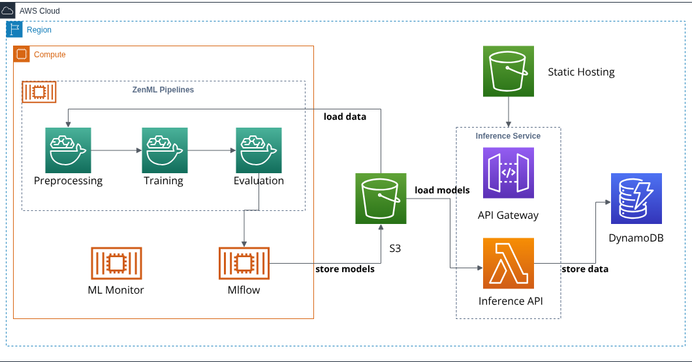

#  MLOps House Price Prediction Project

End-to-end MLOps pipeline for house price prediction with monitoring, inference, and automated workflows.

<p align="center">  </p>
## 🏗️ Architecture

- **ML Pipeline**: Data processing → Feature engineering → Model training
- **Experiment Tracking**: MLflow for model versioning and metrics
- **Inference**: AWS Lambda functions for predictions and feedback
- **Monitoring**: Streamlit dashboard with Evidently for model drift detection
- **Orchestration**: ZenML pipelines with automated workflows

## 📁 Project Structure

```
mlops-house-project/
├── data                # Raw and processed datasets
├── inference           # Serverless inference endpoints
├── monitoring          # Model monitoring and drift detection
├── notebooks           # Jupyter notebooks for exploration
├── src                 # Core ML pipeline code
└── .github/workflows/  # CI/CD automation
```

## 🚀 Quick Start

### 1. Setup Environment

```bash
git clone <repo-url>
cd mlops-house-project
python -m venv venv
source venv/bin/activate  # Linux/Mac
pip install -r requirements.txt
```

### 2. Start MLflow Tracking

```bash
cd deployment/mlflow
docker compose up -d
# Access MLflow UI at http://localhost:5555
```

### 3. Run ML Pipeline

```bash
# Data processing
python src/run_data_pipeline.py

# Feature engineering
python src/run_feature_pipeline.py

# Model training
python src/run_model_pipeline.py
```

### 4. Start Monitoring Dashboard

```bash
cd monitoring
docker compose up -d
# Access dashboard at http://localhost:8501
```

### 5. Deploy Inference Service

```bash
# Local API testing
cd src/api
uvicorn main:app --reload

# Lambda deployment
cd inference_service/prediction-image
docker build -t house-price-prediction .
```

## 🔧 Key Components

- **ZenML Pipelines**: Orchestrated ML workflows
- **MLflow**: Experiment tracking and model registry
- **Evidently**: Data drift and model performance monitoring
- **AWS Lambda**: Serverless inference endpoints
- **Streamlit**: Interactive monitoring dashboard
- **FastAPI**: Local development API

## 📊 Monitoring

The monitoring dashboard provides:
- Model performance metrics
- Data drift detection
- A/B testing results
- Real-time inference logs