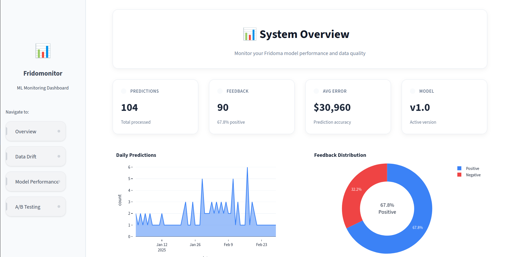

# ML Monitoring Dashboard


A monitoring dashboard for machine learning models built with Streamlit and Evidently AI. Track model performance, data drift, and prediction quality in production.

## Features

- **Overview Dashboard** - Key metrics and model health at a glance
- **Data Drift Detection** - Monitor input data distribution changes
- **Prediction Drift Analysis** - Track prediction distribution shifts
- **Model Performance** - Real-time performance metrics and trends
- **A/B Testing** - Compare model versions and experiments

## Dashboard Screenshots
<p align="center">  </p>


## Project Structure

```
monitoring/
├── dashboard.py          # Main Streamlit application
├── pages/               # Dashboard pages
│   ├── overview.py
│   ├── data_drift.py
│   ├── prediction_drift.py
│   ├── model_performance.py
│   └── ab_testing.py
├── evidently-report/    # Report generation scripts
├── data/               # Training and reference data
├── logs/               # Inference and feedback logs
└── reports/            # Generated HTML reports
```

## Key Components

- **Streamlit** - Interactive web dashboard framework
- **Evidently AI** - ML monitoring and drift detection
- **Plotly** - Interactive visualizations
- **Pandas** - Data manipulation and analysis

## Usage

1. **Data Monitoring** - Upload reference data and monitor incoming predictions
2. **Drift Detection** - Automatically detect data and prediction drift
3. **Performance Tracking** - Monitor model accuracy and performance metrics
4. **Report Generation** - Generate detailed HTML reports for analysis

## Configuration

The dashboard automatically loads data from:
- `data/` - Reference datasets
- `logs/` - Real-time inference logs
- `reports/` - Pre-generated Evidently reports

## Quick Start

### Prerequisites
- Python 3.8+
- pip

### Installation

1. Clone the repository
```bash
git clone <repository-url>
cd monitoring
```

2. Install dependencies
```bash
pip install -r requirements.txt
```

3. Run the dashboard
```bash
streamlit run dashboard.py
```

The dashboard will be available at `http://localhost:8501`

### Docker Setup

```bash
docker-compose up -d
```
